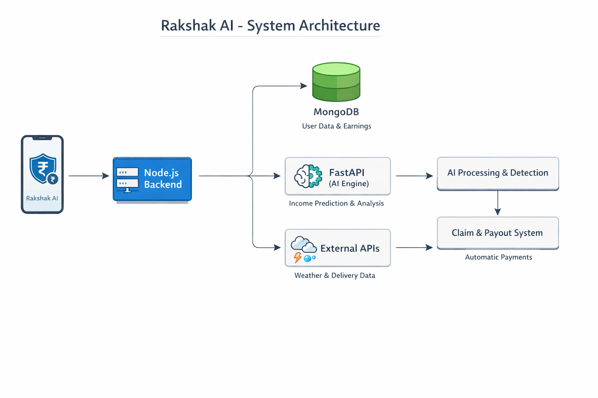

India’s rapidly growing gig economy, powered by delivery platforms such as Zomato, Swiggy, and other on-demand services, has become a critical backbone of urban life. However, the livelihoods of these delivery partners are highly vulnerable to external disruptions like extreme weather conditions, pollution, and unexpected local restrictions. These factors can significantly reduce working hours, leading to sudden and unpredictable income loss. Despite their essential role in the economy, gig workers currently lack a reliable financial safety net to protect against such uncontrollable events.

The core challenge lies in providing a seamless, automated, and fair mechanism to safeguard their earnings without adding complexity to their already demanding workflows. Traditional insurance models are not designed for dynamic, short-term income fluctuations, especially in a weekly earning cycle. Therefore, there is a need for an intelligent, parametric insurance solution that can monitor real-world triggers, estimate income loss accurately, and provide instant financial support—ensuring stability and security for gig workers in an uncertain environment.

---

## Rakshak AI
### **Protecting every delivery, every day.**

### **Rakshak AI** is a smart income protection system that detects real-world disruptions and automatically compensates food delivery workers for the income they lose—ensuring financial security without any manual claims.

Rakshak AI is like a smart helper for food delivery workers that protects their daily earnings. It first understands how much a worker usually earns in a week and then estimates how much they are likely to earn each day. At the same time, it keeps an eye on things like heavy rain, floods, pollution, or sudden restrictions that can stop deliveries from happening.

If something like this occurs and the worker is unable to work, Rakshak AI quickly identifies the situation and calculates how much income the worker is losing for that day. Instead of making the worker apply for help, the system automatically steps in and provides financial support. This makes the whole process simple, fast, and stress-free.

In short, Rakshak AI acts like a safety net for delivery workers—so even if unexpected problems stop them from working, they don’t have to worry about losing their daily income.

---

## How Rakshak AI Works

* **Worker Registration**
    - The delivery worker signs up and connects their app or provides weekly income details.

* **Earnings Understanding**
    - Rakshak AI analyzes the weekly income and estimates expected daily earnings.

* **Continuous Monitoring**
    - The system keeps checking external conditions like rain, floods, pollution, or restrictions.

* **Disruption Detection**
    - If any issue occurs that affects deliveries, the system detects it instantly.

* **Income Loss Calculation**
    - Rakshak AI compares expected income with actual earnings to find the loss.

* **Automatic Claim Creation**
    - The system automatically generates a claim—no manual action needed from the worker.

* **Instant Payout**
    - The calculated compensation is sent directly to the worker.

* **Continuous Protection**
    - The worker stays financially protected even during unexpected disruptions.

---

##  Key Features of Rakshak AI

### 1. AI-Based Income Prediction

* Analyzes the worker’s weekly earnings.
* Estimates expected daily income based on patterns.
* Helps in understanding how much income may be lost during disruptions.

### 2. Real-Time Disruption Monitoring

* Continuously checks conditions like weather, pollution, and local restrictions.
* Uses APIs or simulated data to track these events.
* Ensures timely detection of situations affecting work.

### 3. Automatic Trigger Detection

* Identifies when a disruption crosses a defined limit.
* Links the event directly to the worker’s ability to work.
* Initiates the next steps without manual input.

### 4. Income Loss Calculation

* Compares expected income with actual earnings.
* Calculates the exact loss for that period.
* Ensures fair and accurate compensation.

### 5. Zero-Touch Claims Process

* Automatically creates claims when a disruption is detected.
* Removes the need for manual application.
* Makes the process simple and fast for workers.

### 6. Instant Payout System

* Transfers compensation directly to the worker.
* Uses integrated or simulated payment systems.
* Reduces waiting time and financial stress.

### 7. Fraud Detection and Validation

* Verifies worker location and activity.
* Prevents duplicate or false claims.
* Ensures the system is fair and reliable.

### 8. Weekly Coverage Model

* Designed based on weekly earning patterns of gig workers.
* Calculates premiums on a weekly basis.
* Keeps the system affordable and easy to use.

### 9. Simple Dashboard

* Displays earnings, losses, and coverage details.
* Helps workers track their financial protection.
* Provides clear and easy-to-understand insights.

---

## Tech Stack

### Frontend

* **React Native** is used to build the mobile application.
* It provides a simple and smooth interface for delivery workers.
* Users can easily check their earnings, coverage, and payouts.

---

### Backend

* **Node.js** is used to handle the main application logic and APIs.
* **FastAPI** is used for AI-related tasks like income prediction and trigger detection.
* **MongoDB** is used to store user data, earnings, and claim details.
* Integrations include weather APIs, mock delivery data, and payment systems for payouts.

---

## Architecture:

---

##  Payout Model & Insurance Mathematics

### 1. Expected Daily Income Estimation

The system estimates the worker’s expected daily income based on weekly earnings and demand patterns:

$$E_d = \frac{W}{7} \times f_d$$

Where:

* $$( E_d )$$: Expected daily income
* $$( W )$$: Weekly income
* $$( f_d )$$: Demand adjustment factor for a given day (captures variations such as weekends or peak demand periods)

---

### 2. Income Loss Calculation

The income loss is computed by comparing expected income with actual earnings:

$$L = \max(0, E_d - A_d)$$

Where:

* $$( L )$$: Income loss
* $$( A_d )$$: Actual income earned on that day

This ensures that only positive losses are considered, eliminating negative payouts.

---

### 3. Coverage Factor

To ensure sustainability and reduce misuse, a coverage factor is applied:

$$P = L \times C$$

Where:

* $$( P )$$: Final payout amount
* $$( C )$$: Coverage factor (typically between 0.7 and 0.9)

This allows partial coverage while maintaining system stability.

---

### 4. Parametric Trigger Condition

Payouts are activated only when predefined external conditions are met:

$$T = \begin{cases} 1 & \text{if } (R > R_{th}) \lor (AQI > AQI_{th}) \ 0 & \text{otherwise} \end{cases}$$

Where:

* $$( T )$$: Trigger indicator
* $$( R )$$: Rainfall level
* $$( AQI )$$: Air Quality Index
* $$( R_{th}, AQI_{th} )$$: Threshold values

This ensures payouts are strictly linked to real-world disruptions.

---

### 5. Final Payout Formula

The final payout is determined by combining all components:

$$\text{Payout} = T \times C \times \max(0, E_d - A_d)$$

---

### 6. Additional Constraints (Optional Enhancements)

* **Maximum Payout Cap:** Limits excessive payouts per day
* **Minimum Loss Threshold:** Ensures claims are triggered only beyond a certain loss percentage
* **Dynamic Factors:** AI can adjust $$( f_d ) and ( C )$$ based on historical patterns and risk levels

---

## Suggestions for Future Enhancements

The current solution provides basic income protection for delivery workers. However, it can be further improved by adding the following features:

* **Premium Plans:** Introduce optional plans with higher coverage and better payout limits.

* **Custom Coverage Options:** Allow users to choose their coverage level based on their needs.

* **Additional Trigger Conditions:** Include more factors such as traffic issues, app downtime, or demand drops.

* **Improved AI Models:** Enhance prediction accuracy using advanced machine learning techniques.

* **Faster Payout Processing:** Reduce payout time to provide quicker financial support.

* **User Insights Dashboard:** Show earnings trends and risk insights to help users make better decisions.
